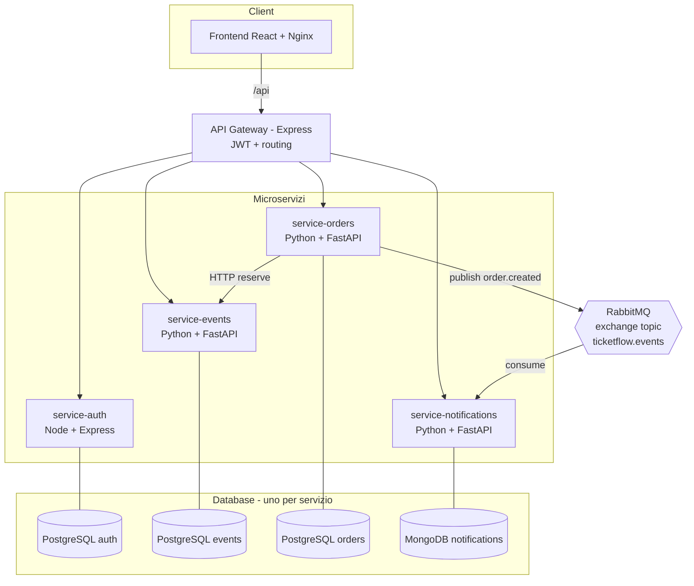
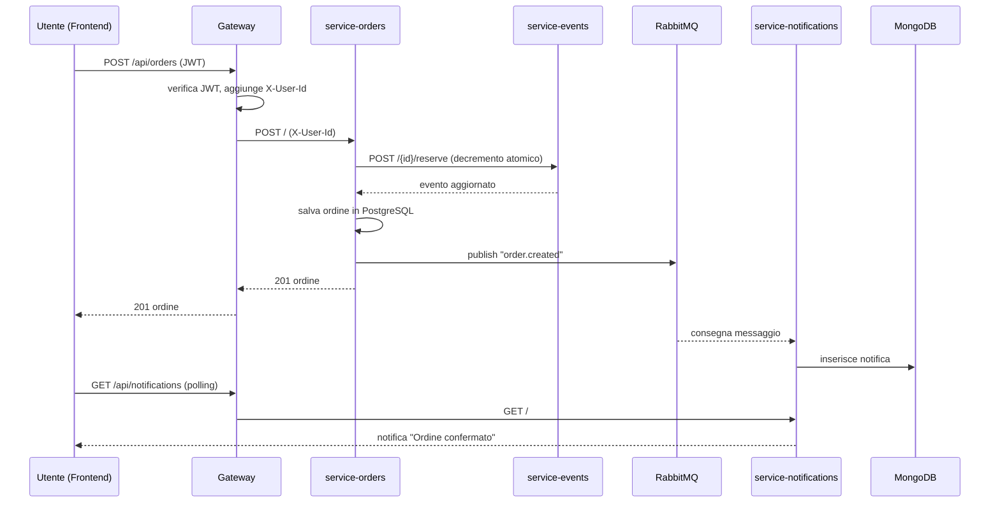

# Architettura di TicketFlow

## Vista d'insieme

TicketFlow è un sistema di **ticketing per eventi** costruito con
un'architettura a **microservizi**. Ogni servizio ha una singola responsabilità
e possiede il **proprio database** (pattern *database per servizio*). La
comunicazione è sia **sincrona** (HTTP tramite gateway e tra orders→events) sia
**asincrona** (eventi su RabbitMQ verso le notifiche).



## Flusso "creazione ordine" (sincrono + asincrono)



## Scalabilità

`service-notifications` è progettato come **competing consumer**: più repliche
condividono la stessa coda durevole `notifications.order-created`. RabbitMQ
distribuisce i messaggi in **round-robin** (`prefetch_count=1`), quindi ogni
evento è elaborato da **una sola** replica.

```bash
docker compose up -d --scale service-notifications=3
```

## Reti e volumi

- **frontend-net**: frontend ↔ gateway.
- **backend-net**: gateway ↔ microservizi ↔ database ↔ broker ↔ registry ↔ portainer.
- Volumi persistenti per ogni database, per RabbitMQ, per il registry e per Portainer.
